# Architecture

Phone Agent is a modular monolith initially, with service boundaries that can later become independent services. The core architectural choice is that `TopicThread` and `CommunicationItem` are domain-owned product objects. Calls are one communication channel, not the center of the model.

## High-Level System Architecture

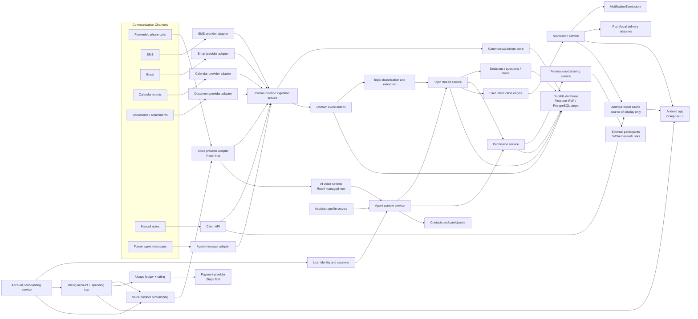

The Android Room cache is intentionally client-side and non-authoritative. It stores last-known provider-neutral display snapshots so the app can render quickly and remain navigable when refreshes fail. Backend APIs remain authoritative for permissions, billing gates, transfer/live-answer actions, sharing, calendar writes, topic mutations, and all paid side effects.

## Pay-As-You-Go Billing Flow

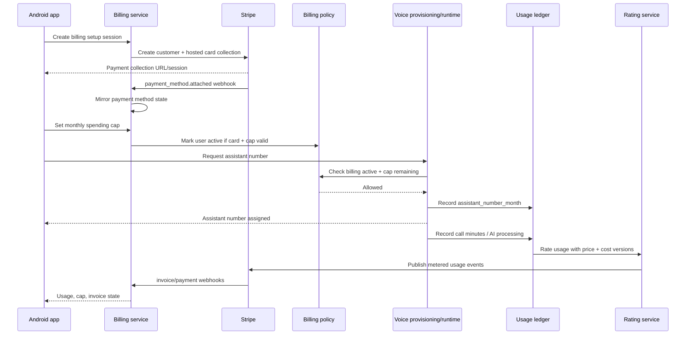

## Billing Domain Model

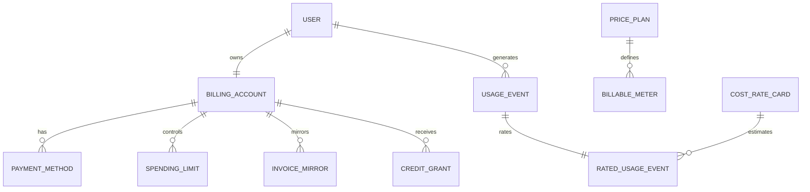

## Notification Product Flow

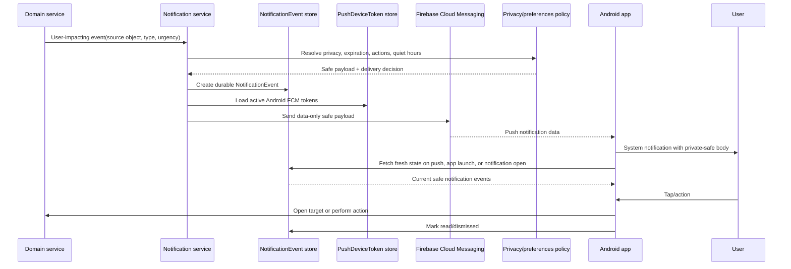

## Multi-User Onboarding And Retell Provisioning

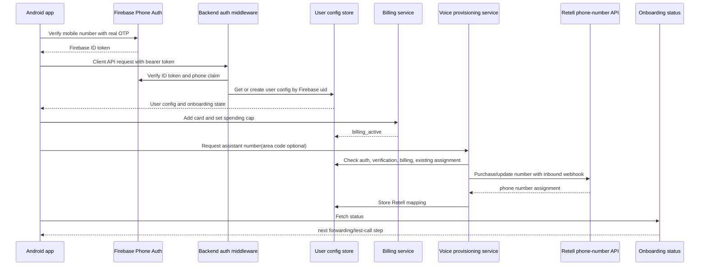

## Assistant Profile To Voice Provider

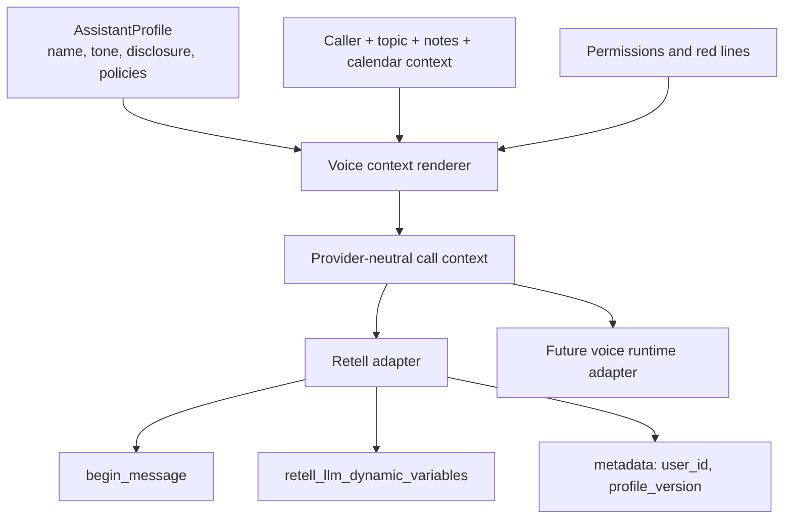

## Inbound Forwarded Call Flow

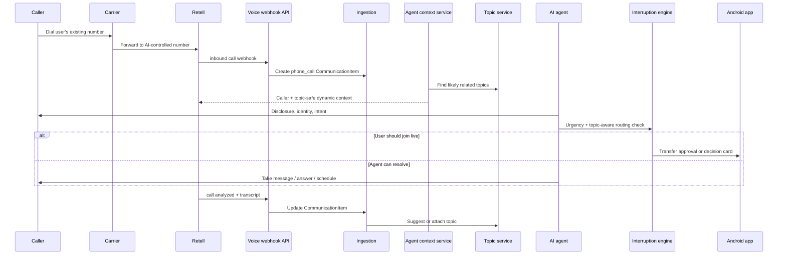

## Cross-Channel Ingestion Flow

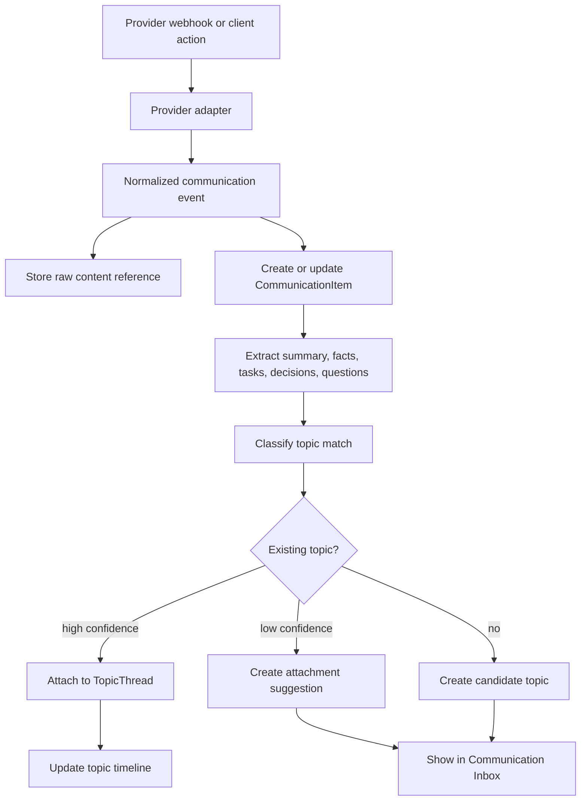

## Topic Classification Sequence

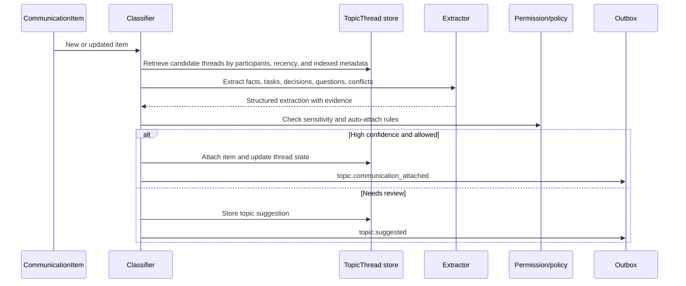

## User Interruption Engine

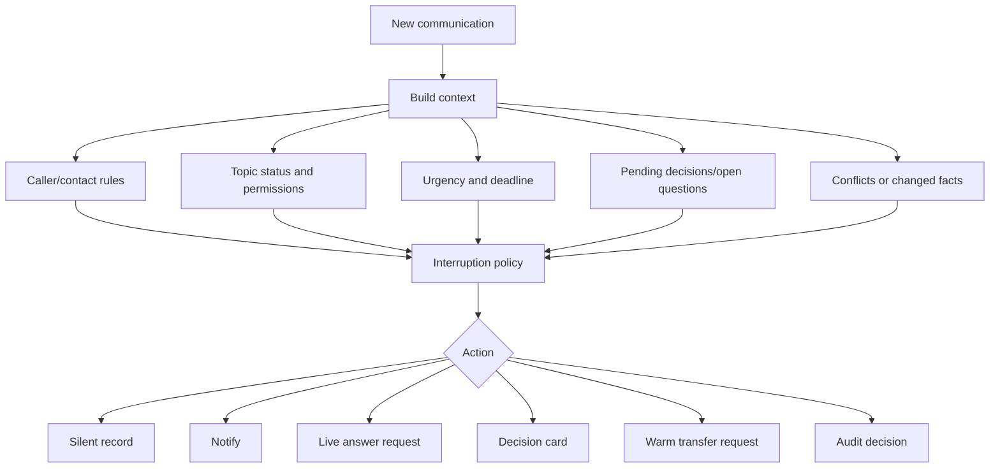

## Permissioned Sharing Flow

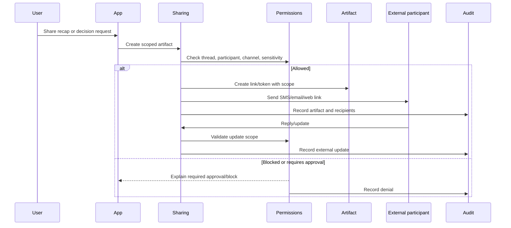

## Agent-To-Agent Sequence

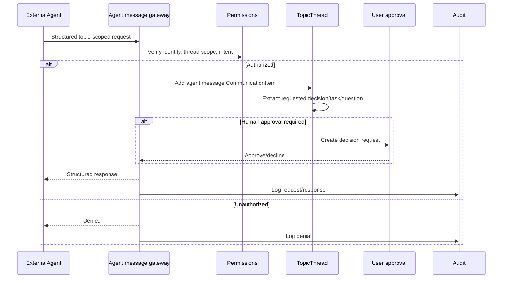

## Data Model / Entity Relationship Diagram

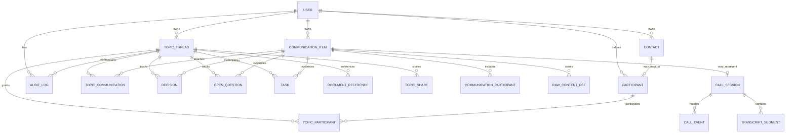

## Topic Thread As Security Boundary

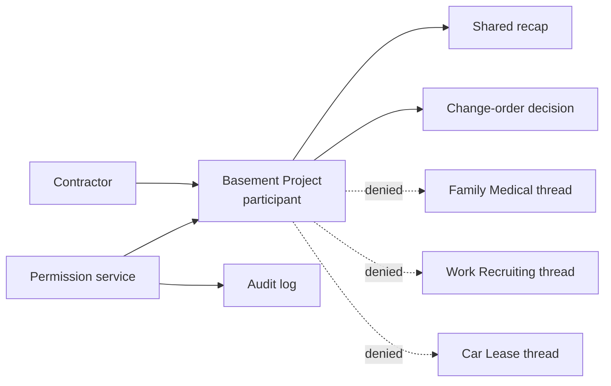

## Provider Abstraction Model

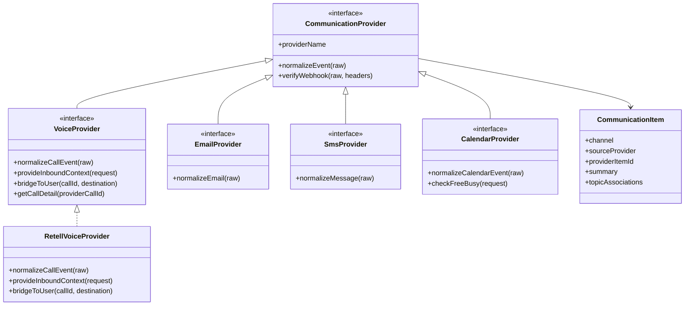
